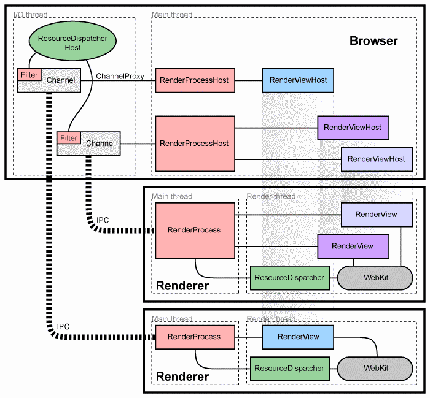
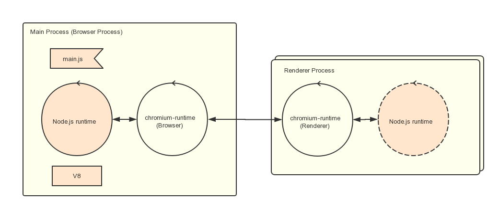

# Chromium 架构

Chromium作为现代的浏览器，使用一个Brower线程维护程序，然后对应每一个页面维护单独的render线程做隔离。保证页面崩溃不会导致程序崩溃。同时为了IPC通信提供单独的辅助线程。

# Electron 架构

Electron在Chromiun的基础上，增加了Node,js的运行环境（Chromiun本身只有render才有V8引擎，所以需要单独为Browser增加V8引擎运行javascript）。允许用Javascript/Node.js来定义自己的程序。

# Node单线程机制

Node.js为了利用多核的能力，本身设计为单线程。而Render也是单线程。为了避免繁重的计算影响UI的响应，应该将耗时的操作独立到单独的线程中去。

